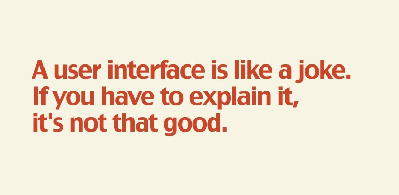

# Intro to Design for Interaction

A repository to store all the course content files for **'Intro to Design for Interaction'**. It includes files like class notes, assignments, labs, etc. for the course.

---

## Instructor

- George Paravantes

---

## What We Learn

In this class, we learn about the principles of Interaction Design that can be created for the UI of any kind of application.[^1]

_A programming meme for Interaction Design"_

> :memo: **Note:** This class makes you feel like you are good in Arts.

[^note]: This class takes place in the J 110 room every Thursday from 3:20 AM - 6:20 PM.

---

## Learning Resource
[Codecademy IXD](https://www.codecademy.com/learn/learn-interaction-design)

---

## Sample - Interaction Design

- IxD Elements and Laws
- Figma
- IxD Principles
- Wireframes and Prototypes

[^1]: We have learned the above topics by now:
